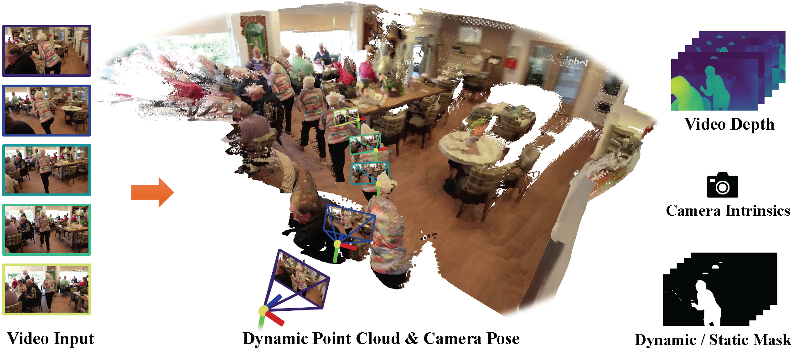

# MonST3R: A Simple Approach for Estimating Geometry in the Presence of Motion

**MonST3R**  processes a dynamic video to produce a time-varying dynamic point cloud, along with per-frame camera poses and intrinsics, in a predominantly **feed-forward** manner. This representation then enables the efficient computation of downstream tasks, such as video depth estimation and dynamic/static scene segmentation.

This repository is the official implementation of the paper:

[**MonST3R: A Simple Approach for Estimating Geometry in the Presence of Motion**](https://monst3r-project.github.io/files/monst3r_paper.pdf)
[*Junyi Zhang*](https://junyi42.github.io/),
[*Charles Herrmann+*](https://scholar.google.com/citations?user=LQvi5XAAAAAJ),
[*Junhwa Hur*](https://hurjunhwa.github.io/),
[*Varun Jampani*](https://varunjampani.github.io/),
[*Trevor Darrell*](https://people.eecs.berkeley.edu/~trevor/),
[*Forrester Cole*](https://scholar.google.com/citations?user=xZRRr-IAAAAJ&hl),
[*Deqing Sun**](https://deqings.github.io/),
[*Ming-Hsuan Yang**](https://faculty.ucmerced.edu/mhyang/)
Arxiv, 2024. [**[Project Page]**](https://monst3r-project.github.io/) [**[Paper]**](https://monst3r-project.github.io/files/monst3r_paper.pdf) [**[Video]**](https://monst3r-project.github.io/files/teaser_vid_v2_lowres.mp4) [**[Demo🔥]**](https://monst3r-project.github.io/page1.html) 



## TODO
- [x] Release model weights at [Google Drive](https://drive.google.com/file/d/1Z1jO_JmfZj0z3bgMvCwqfUhyZ1bIbc9E/view?usp=sharing)
- [ ] Release inference code for global optimization (est. time: 10/21)
- [ ] Release 4D visualization code (est. time: 10/21)
- [ ] Release evaluation code (est. time: 10/21)
- [ ] Release training code & dataset preparation (est. time: 10/21)

## Getting Started

We currently provide pre-trained model weights for MonST3R, which can be downloaded from [Google Drive](https://drive.google.com/file/d/1Z1jO_JmfZj0z3bgMvCwqfUhyZ1bIbc9E/view?usp=sharing).


The model weights can already be applied for **Two View input** using DUSt3R's inference code. To test the model, follow the instructions below:

1. Install DUSt3R by following the instructions [here](https://github.com/naver/dust3r?tab=readme-ov-file#installation).
2. Run `python3 demo.py --weights path/to/MonST3R_PO-TA-S-W_ViTLarge_BaseDecoder_512_dpt.pth`.

We will release the code for global optimization, 4D visualization, evaluation , and dataset preparation soon.

## Citation

If you find our work useful, please cite:

```bibtex
@article{zhang2024monst3r,
  author    = {Zhang, Junyi and Herrmann, Charles and Hur, Junhwa and Jampani, Varun and Darrell, Trevor and Cole, Forrester and Sun, Deqing and Yang, Ming-Hsuan},
  title     = {MonST3R: A Simple Approach for Estimating Geometry in the Presence of Motion},
  journal   = {arXiv preprint arxiv:2410},
  year      = {2024}
}
```

## Acknowledgements
Our code is largely based on [DUST3R](https://github.com/naver/dust3r), our camera pose estimation evaluation script is based on [LEAP-VO](https://github.com/chiaki530/leapvo), and our visualization code is based on [Viser](https://github.com/nerfstudio-project/viser). We thank the authors for their excellent work!